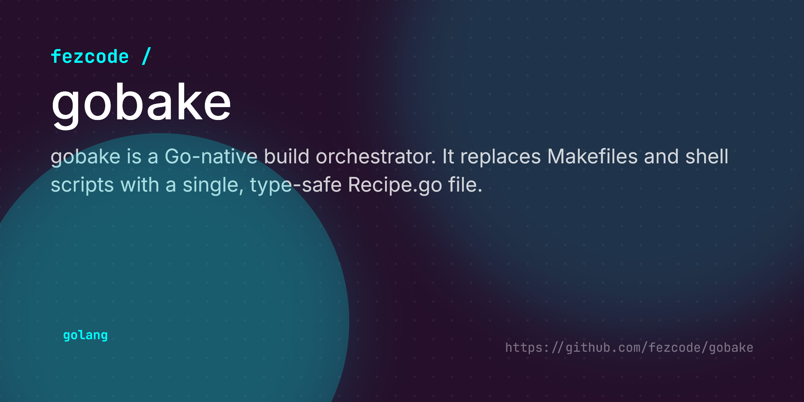

# gobake



**gobake** is a Go-native build orchestrator. It replaces Makefiles and shell scripts with a single, type-safe `Recipe.go` file.

Inspired by `nob.h`, `gobake` allows you to write your build logic in Go, which is then compiled and executed on the fly. It also features a `recipe.piml` file for managing project metadata and dependencies.

## Features

*   **Go-Native:** Write your build scripts in Go. No new syntax to learn.
*   **Zero Dependencies:** The build system is just a Go program.
*   **Metadata Management:** Centralized project info (Version, Authors, Tools) in `recipe.piml`.
*   **Task Dependencies:** Define ordered execution requirements for tasks.
*   **Auto-Versioning:** Built-in semantic versioning bumping (`gobake bump patch`).
*   **Cross-Compilation:** Simple helpers for baking binaries for different platforms.
*   **Self-Bootstrapping:** Just run `gobake`. It handles the rest.

## Installation

```bash
go install github.com/fezcode/gobake/cmd/gobake@latest
```

## Quick Start

1.  **Initialize a new project:**

    ```bash
    mkdir my-project
    cd my-project
    gobake init
    ```

    This creates a `recipe.piml` and a `Recipe.go`.

2.  **Run a task:**

    ```bash
    gobake build
    ```

## Usage

### Commands

*   `gobake init`: Scaffolds a new `Recipe.go` and `recipe.piml`.
*   `gobake version`: Displays the current version of gobake.
*   `gobake help`: Displays the list of commands and available tasks.
*   `gobake bump [patch|minor|major]`: Increments the version in `recipe.piml`.
*   `gobake template <git-url>`: Clones a repo and initializes it with gobake.
*   `gobake add-tool <url>`: Adds a dev tool to `recipe.piml`.
*   `gobake remove-tool <url>`: Removes a dev tool from `recipe.piml`.
*   `gobake add-dep <url>`: Adds a library dependency (`go get`).
*   `gobake remove-dep <url>`: Removes a library dependency.
*   `gobake <task>`: Runs a defined task (e.g., `build`, `test`, `deploy`).

### The `recipe.piml` File

This file holds your project's metadata.

```piml
(name) my-app
(version) 1.0.0
(description) A cool Go application
(license) MIT
(tools)
    > github.com/golangci/golangci-lint/cmd/golangci-lint@latest
```

### The `Recipe.go` File

This is where you define your build logic.

```go
//go:build ignore
package bake_recipe

import (
	"fmt"
	"github.com/fezcode/gobake"
)

func Run(bake *gobake.Engine) error {
	if err := bake.LoadRecipeInfo("recipe.piml"); err != nil {
		return fmt.Errorf("error loading recipe.piml: %v", err)
	}
	
	bake.Task("build", "Builds the binary", func(ctx *gobake.Context) error {
		ctx.Log("Building v%s...", bake.Info.Version)
		return ctx.BakeBinary("linux", "amd64", "bin/app")
	})

	bake.TaskWithDeps("deploy", "Deploy after build", []string{"build"}, func(ctx *gobake.Context) error {
		ctx.Log("Deploying...")
		return nil
	})
	
	return nil
}
```

## Documentation

See the [docs/](docs/) directory for detailed guides.
